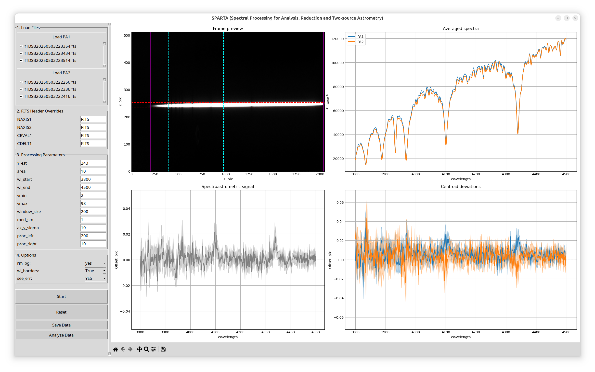
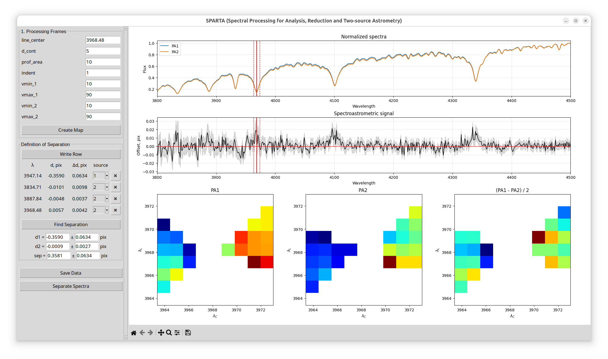
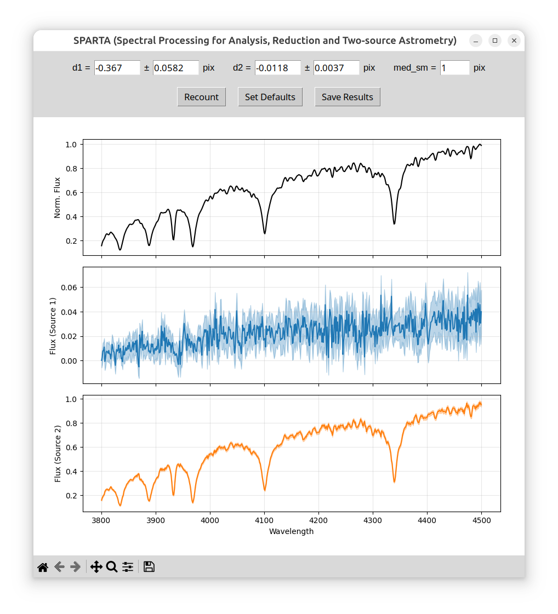

# SPARTA (Spectral Processing for Analysis, Reduction and Two-source Astrometry)

Программа для комплексной обработки спектроастрометрических наблюдений. Процесс работы разделен на три последовательных этапа, каждый из которых выполняется в отдельном графическом окне.

## Running
To ensure the program works correctly, it is recommended to use a virtual environment to avoid dependency conflicts.

1. Download the project files to your working directory.
2. Create and activate a virtual environment.
3. Install the required dependencies:

```bash
   pip install -r requirements.txt
```
4. Run the graphical interface:

```bash
   python SPARTA_main.py
```

Программа работает с FITS-файлами. Ожидается, что массив данных и заголовок располагаются в нулевом расширении файла. Если структура ваших файлов отличается, их необходимо предварительно переконвертировать.

---

## Этап 1: Предобработка

<div align="center">
  
</div>

На данном этапе загружаются спектроастрометрические кадры, полученные в двух позиционных углах (Load PA1 и Load PA2), настраивается область обработки и извлекается первичный сигнал.

### Настройки FITS
Если FITS-заголовки не содержат нужных ключей, замените значение `FITS` на числовые параметры:
* **NAXIS1 / NAXIS2** — число пикселей по горизонтальной и вертикальной осям.
* **CRVAL1** — начальная длина волны на кадре.
* **CDELT1** — шаг по длине волны на один пиксель.

### Параметры

| Параметр | Описание |
|---|---|
| **Y_est / area** | Положение центра спектра и отступы от него (по оси Y). На графике кадра это красные штриховые линии. Их можно двигать мышью (центр подстроится автоматически) |
| **wl_start / wl_end** | Исследуемый диапазон длин волн (ограничен голубыми штриховыми линиями, можно двигать мышью) |
| **vmin / vmax** | Диапазон яркости для отображения кадра (не влияет на расчеты) |
| **window_size** | Окно сглаживания методом скользящего среднего для устранения тренда из спектров перед сложением |
| **med_sm** | Параметр медианного сглаживания графиков |
| **ax_y_sigma** | Масштаб отображения оси Y для нижних графиков |
| **proc_left / proc_right** | Отсечение краев кадра по оси X (фиолетовые линии) для исключения краевых шумов |

### Управление
В блоке **Options** можно включить/отключить удаление фона (`rm_bg`), использование границ длин волн (`wl_borders`) и отображение погрешностей на графиках (`see_err`).

* **Взаимодействие с графиками:** Щелчок *правой кнопкой мыши* по любому графику (кроме кадра) ставит зеленую синхронизирующую линию на всех панелях для сравнения спектральных особенностей.
* **Графики:** Справа вверху — усредненные спектры. Справа внизу — отклонения центроидов для PA1 и PA2. Слева внизу — спектроастрометрический сигнал (полуразность этих отклонений).
* **Analyze Data:** Сохраняет результаты первого этапа и открывает окно следующего шага.

---

## Этап 2: Спектроастрометрическая обработка

<div align="center">
  
</div>

На этом этапе анализируются индивидуальные спектральные линии для определения истинных координат источников. Алгоритм вычитает пространственный профиль спектра в континууме из профиля в линии для множества точек вокруг центра линии. Результаты (измерения координаты центра) отображаются на трех цветовых картах внизу (PA1, PA2 и их полуразность).

### Параметры

| Параметр | Описание |
|---|---|
| **line_center** | Центр исследуемой линии. Можно ввести вручную или кликнуть *правой кнопкой мыши* по верхним графикам |
| **d_cont** | Максимальный отступ от центра линии для вычисления координат |
| **prof_area** | Ширина области обработки профиля (по умолчанию берется из Этапа 1). |
| **indent** | Отступ от точек совпадения координат профилей линии и континуума. |
| **vmin_1,2 / vmax_1,2** | Процент отклонения точек цветовых карт от среднего значения для фильтрации результатов по PA1 и PA2. |

### Порядок работы на Этапе 2:
1. Выберите линию (`line_center`) и нажмите **Create Map**. Оцените результат на цветовых картах.
2. Нажмите **Write Row**, чтобы зафиксировать y-координату в таблице слева.
3. В таблице в столбце `source` укажите, к какому из двух источников относится эта линия (1 или 2).
4. Повторите процесс для других линий обоих источников.
5. Нажмите **Find Separation**, чтобы программа вычислила общие координаты и разделение `sep` (d1, d2) между источниками на основе собранных данных.
6. Нажмите **Separate Spectra** для перехода к финальному шагу.

---

## Этап 3: Разделение спектров

<div align="center">
  
</div>

Финальное окно осуществляет разделение общего спектра на два независимых компонента, используя координаты `d1` и `d2`, найденные на предыдущем этапе.

* **Параметры:** Вы можете вручную изменять значения `d1` и `d2`, чтобы исследовать их влияние на итоговый результат. Параметр `med_sm` позволяет применить медианное сглаживание к итоговым графикам.
* **Recount:** Пересчитать спектры с новыми введенными значениями d1/d2.
* **Set Defaults:** Вернуть значения d1 и 60%d2, рассчитанные на Этапе 2.
* **Save Results:** Сохранить итоговые разделенные спектры в файл.