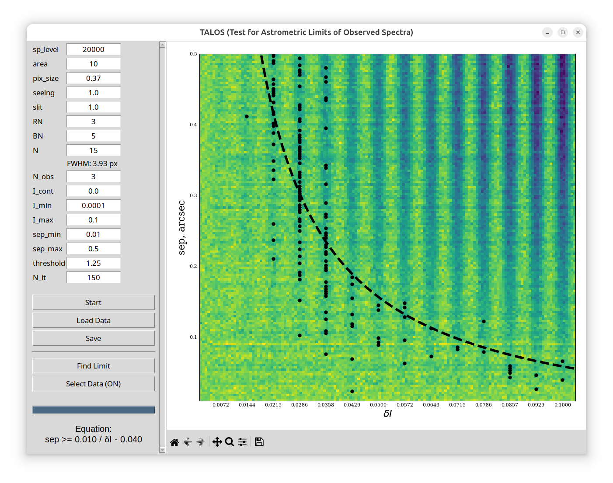

# TALOS (Test for Astrometric Limits of Observed Spectra)

<div align="center">
  
</div>

## Overview
TALOS is a software designed for planning spectro-astrometric observations. It allows you to determine the detection limit of a spectro-astrometric signal under various instrumental parameters and configurations of the observed system.

## How It Works
The program simulates a system of two point sources: a bright one and a faint one. The main goal is to determine under what conditions the faint component will be detectable.

For the simulation, the brightness of the primary (bright) source and the distance between the components are specified. The spectrum of the bright source is modeled as a constant with a given brightness level. The spectrum of the faint source is represented by a set of spectral peaks with varying intensity.

During the calculation process, the program tracks the first detectable peak for different values of separation between the objects. The points on the right-hand plot indicate these first distinguishable peaks. Thus, the tool helps to understand the range of distances and component brightness ratios at which they will be reliably distinguishable in spectro-astrometric observations.

## Running
To ensure the program works correctly, it is recommended to use a virtual environment to avoid dependency conflicts.

1. Download the project files to your working directory.
2. Create and activate a virtual environment.
3. Install the required dependencies:
   ```bash
   pip install -r requirements.txt
   ```
4. Run the graphical interface:
   ```bash
   python TALOS.py
   ```

## Parameters

| Parameter | Description |
| :--- | :--- |
| **sp_level** | Intensity of the bright source in ADU |
| **area** | Half-width of the region around the center of the spectrum (in pixels) selected for analysis |
| **pix_size** | Angular pixel size of the instrument in arcsec |
| **seeing** | Atmospheric seeing scale in arcsec |
| **slit** | Spectrograph slit size in arcsec |
| **RN** | Readout noise in e/ADU |
| **BN** | Background level in ADU |
| **N** | Number of peaks in the spectrum of the second (faint) source *(Below this field, the FWHM of the peaks in pixels, calculated based on the specified parameters, is automatically displayed)* |
| **N_obs** | Number of observations for each angular separation between the sources |
| **I_cont** | Continuum level of the faint source |
| **I_min** / **I_max** | Relative intensity ranges |
| **sep_min** / **sep_max**| Angular separation ranges of the components in arcsec |
| **threshold** | Cutoff threshold in sigma |
| **N_it** | Number of iterations (corresponds to the number of rows in the resulting frame) |

## Interface Controls
* **Start:** Starts the simulation and calculation process.
* **Load Data:** Allows loading a previously calculated and saved model.
* **Save:** Saves the current calculation results.
* **Find Limit:** Approximates the found points (first distinguishable peaks) with a theoretical dependence. The equation of the fitting curve is displayed in the lower-left part of the window.
* **Select Data (OFF/ON):** A toggle switch that allows you to use the mouse cursor to select only the points on the plot you want to analyze.

The program supports simulating the spectro-astrometric effect in both emission and absorption lines. To simulate absorption lines, you must set a negative peak intensity. In this case, it is important to ensure that the absolute value of the negative intensity does not exceed the continuum level of the faint source.
